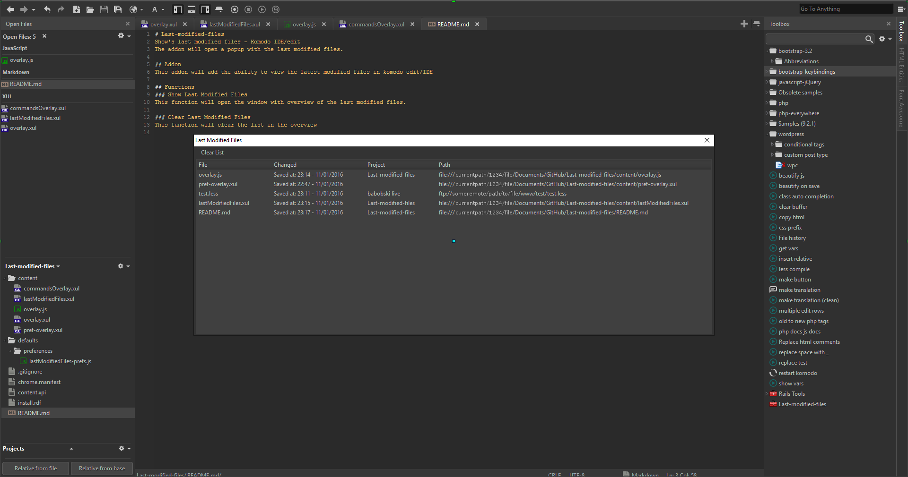

# Last-modified-files
Show's last modified files - Komodo IDE/edit  
The addon will open a popup with the last modified files.

## Addon
This addon gives you the ability to view the latest modified files in komodo edit/IDE.  
This addon will keep track of the changed files while komodo is open.  
Clicking an a item in the window, will open or go to the selected file.

## Menu
You can access the last modified files window true the menu.  
<b>Tools > Last modified files > ...</b>
#### Show Last Modified Files
This function will open the window with overview of the last modified files.

#### Clear Last Modified Files
This function will clear the list in the overview

### Keybindings
You can setup a key binding for showing the last modified files popup.  
<b>Preferences > keybindings > Last m..</b>

### Multiple windows
When working with multiple komodo windows, this addon will keep track of the changed files of each window separate.  
When opening the popup, this will show the changed files from the komodo window it is opened in.
